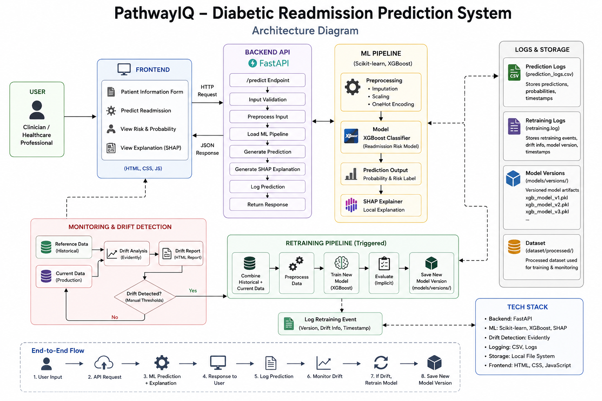
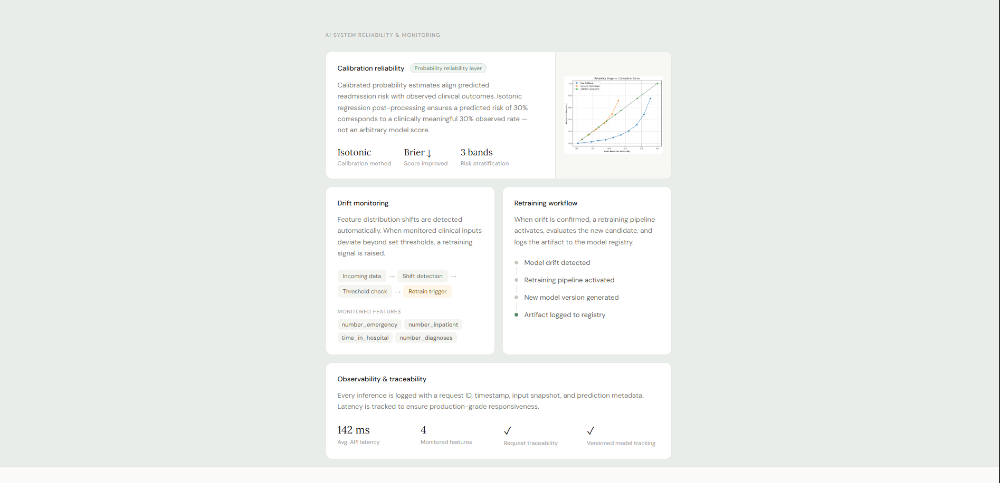
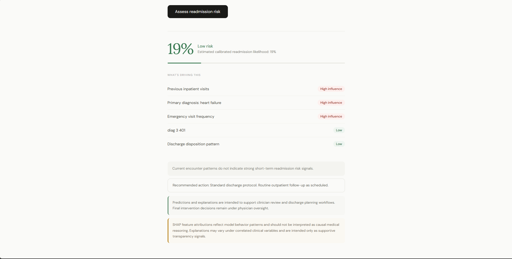
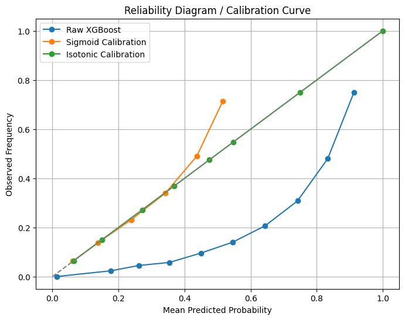

# PathwayIQ - Explainable Hospital Readmission Intelligence System

## Live Demo

**Public Deployment URL:** http://pathwayiq.duckdns.org


PathwayIQ is a reliability-aware clinical decision-support intelligence system designed to estimate calibrated 30-day hospital readmission risk for diabetic patients using explainable machine learning and lifecycle-aware monitoring infrastructure.

The system combines calibrated XGBoost inference, SHAP-based explainability, drift monitoring, retraining workflows, operational observability, FastAPI deployment, and CI/CD-enabled lifecycle management into a production-oriented healthcare AI pipeline designed to support clinician review - not replace it.


## System Architecture




## Problem Statement

Hospital readmissions are a major challenge in healthcare systems due to increased operational costs, resource strain, patient health risks, and inefficient discharge planning. The objective of PathwayIQ is to identify high-risk patients before discharge using interpretable machine learning.

Dataset Link: [UCI-Diabetes 130-US Hospitals for Years 1999-2008](https://archive.ics.uci.edu/dataset/296/diabetes+130-us+hospitals+for+years+1999-2008)

## Key Features

**Explainable AI Predictions**   
XGBoost-based readmission prediction with SHAP-powered local feature explanations. Top contributing risk factors are returned per prediction.

**End-to-End ML Pipeline**   
Covers preprocessing, feature engineering, categorical encoding, imbalance handling, and pipeline serialization.

**FastAPI Backend**   
REST inference API with input validation, structured prediction responses, and latency tracking.

**Product-Style Frontend**   
Clean healthcare-focused UI with real-time risk scoring, visual prediction interface, and risk explanation display.

**Observability and Logging**   
Prediction logging, retraining event logging, request IDs, and inference latency tracking.

**Drift Detection**   
Simulated production drift with distribution shift monitoring and threshold-based drift analysis.

**Retraining Pipeline**   
Automatic retraining trigger logic, versioned model artifacts, and lifecycle-aware model management.


## Quantified System Highlights

- Trained on 100K+ real-world diabetic patient encounters
- Processes 39 engineered clinical and encounter-level features
- Generates real-time readmission risk predictions with explainable SHAP outputs
- Tracks inference latency and prediction metadata for observability
- Detects simulated production drift across critical healthcare variables
- Automatically triggers retraining workflows when drift thresholds are exceeded
- Maintains versioned ML model artifacts for lifecycle traceability
- Supports end-to-end ML lifecycle workflows from training to monitoring and retraining


## Reliability-Oriented Design Principles

PathwayIQ was designed around reliability-aware healthcare AI principles:
- calibrated probability estimation,
- explainable prediction reasoning,
- operational monitoring,
- drift-aware lifecycle management,
- clinician-facing decision support.

The system prioritizes trustworthy risk estimation over raw classification confidence.


# Deployment

PathwayIQ is deployed as a containerized FastAPI application on AWS EC2.

### Deployment Stack

- Dockerized inference service
- Ubuntu EC2 instance hosting
- FastAPI backend serving predictions
- Public HTTP endpoint for live access
- Serialized XGBoost inference pipeline
- Frontend rendered through FastAPI templates

### Deployment Highlights

- Cross-platform containerized runtime
- Portable filesystem-safe architecture
- Production-style API serving
- Publicly accessible inference endpoint


# CI/CD Pipeline

PathwayIQ includes an automated CI/CD workflow for deployment consistency and rapid iteration.

### Workflow Overview

GitHub Push  
→ GitHub Actions Pipeline  
→ Docker Image Rebuild  
→ EC2 Deployment Update  
→ Live Application Refresh

### CI/CD Features

- Automated deployment workflow
- Docker-based reproducible builds
- GitHub Actions integration
- Deployment automation on code updates
- Consistent containerized runtime environment


## Demo

[Watch the Video Demo](https://youtu.be/faQD0bsLIvY)

### Prediction Interface



### Explainable Risk Output




## Tech Stack

| Layer | Tools |
|---|---|
| Machine Learning | Scikit-learn, XGBoost, SHAP |
| Backend | FastAPI, Pydantic |
| Frontend | HTML, CSS, JavaScript |
| Monitoring | Evidently AI, Logging, Model Versioning |
| Deployment & Infra | Docker, AWS EC2, GitHub Actions, CI/CD |


## Machine Learning Pipeline

The ML pipeline includes missing value imputation, categorical encoding, numerical scaling, class imbalance handling, calibrated XGBoost classification, and post-hoc probability calibration using isotonic regression.

The final system was optimized for calibrated risk estimation, healthcare interpretability, and deployment-oriented reliability.


## Model Performance

| Metric | Value |
|---|---|
| Model | XGBoost Classifier |
| ROC-AUC | ~0.69 |
| Recall (Readmission Class) | ~0.60 |
| Precision (Readmission Class) | ~0.19 |
| F1 Score | ~0.28 |
| Monitoring Coverage | 4 critical clinical drift features |
| Retraining Strategy | Threshold-triggered retraining |
| Calibration Method | Isotonic Regression |


## Probability Calibration

Most healthcare ML systems optimize ranking metrics such as ROC-AUC but return poorly calibrated probabilities. PathwayIQ applies isotonic regression calibration to align predicted readmission likelihood with observed clinical outcomes.

This improves probability reliability for operational risk stratification workflows.

### Calibration Improvements

| Metric | Raw XGBoost | Calibrated |
|---|---|---|
| ROC-AUC | 0.6902 | 0.6932 |
| Brier Score | 0.2163 | 0.0931 |

  


## Clinical Risk Stratification

Calibrated probabilities are grouped into operational risk bands to support intervention prioritization workflows.

| Risk Band | Interpretation |
|---|---|
| Low Risk | Standard follow-up |
| Moderate Risk | Additional discharge review |
| High Risk | Escalated clinician review recommended |


## Explainability Layer

PathwayIQ surfaces local feature-level explanations for each prediction, including factors such as prior inpatient visits, emergency visit frequency, diagnosis complexity, and hospital stay duration.

These explanations are intended to support clinician review by improving transparency around model behavior.

### Explainability Limitations

SHAP explanations may become unstable under correlated clinical variables and should be interpreted as supportive reasoning signals rather than causal medical explanations.

PathwayIQ surfaces explanations to assist clinician review, not replace clinical judgment.


## Monitoring and Drift Detection

The system includes simulated production drift monitoring. Drift is intentionally introduced by altering emergency visit frequency, inpatient admissions, hospital stay duration, and diagnosis complexity. Manual threshold-based drift detection triggers retraining workflows.


## Automated Retraining Workflow

When drift exceeds threshold limits:

1. Drift is detected
2. Historical and current data are combined
3. New XGBoost pipeline is retrained
4. Versioned model artifact is generated
5. Retraining event is logged

Generated artifacts:

```
models/
└── versions/
    ├── xgb_model_v1.pkl
    ├── xgb_model_v2.pkl
    └── ...
```


## Known Limitations

- Dataset represents historical diabetic encounters and may not generalize across healthcare systems.
- Calibration evaluation currently uses a limited holdout strategy.
- SHAP explanations may vary under correlated feature conditions.
- The system is not intended for autonomous clinical decision-making.


## Future Improvements

- Prospective holdout calibration evaluation
- Subgroup-level calibration consistency analysis
- MLflow-based model registry integration
- Scheduled drift benchmarking pipelines
- Clinician feedback-assisted review workflows
- Automated CI/CD for retraining lifecycle management

## Project Structure

```
pathwayIQ/
│
├── api/
│   └── main.py
│
├── dataset/
│   ├── raw/
│   └── processed/
│
├── monitoring/
│   └── drift_report.py
│
├── retraining/
│   └── retrain.py
│
├── models/
│   └── versions/
│
├── logs/
│
├── src/
│   ├── train.py
│   ├── predict.py
│   └── preprocess.py
│
├── static/
│   ├── style.css
│   └── script.js
│
├── templates/
│   └── index.html
│
└── requirements.txt
```

---

## API Reference

### `POST /predict` — Predict Readmission Risk

**Sample Response**

```json
{
  "request_id": "a1b2c3",
  "risk_score": 0.6622,
  "risk_label": "high",
  "latency_ms": 148.2,
  "top_risk_factors": [
    {
      "feature": "Previous inpatient visits",
      "impact": 0.5317
    }
  ]
}
```


## Getting Started

**1. Clone the repository**

```bash
git clone https://github.com/Himanshu-2678/pathwayIQ.git
cd pathwayIQ
```

**2. Create and activate a virtual environment**

```bash
python -m venv venv

# Windows
venv\Scripts\activate

# Linux / Mac
source venv/bin/activate
```

**3. Install dependencies**

```bash
pip install -r requirements.txt
```

**4. Run the FastAPI server**

```bash
uvicorn api.main:app --reload
```

**5. Open in browser**

```
http://127.0.0.1:8000
```


## License

This project is licensed under the MIT License. You are free to use, modify, and distribute this software with proper attribution.

See the [MIT License](LICENSE) file for full details.
